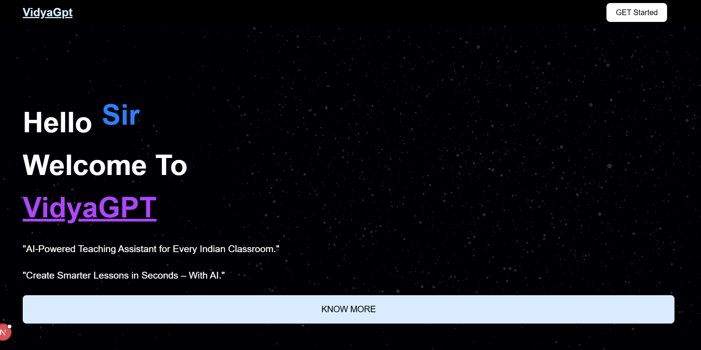
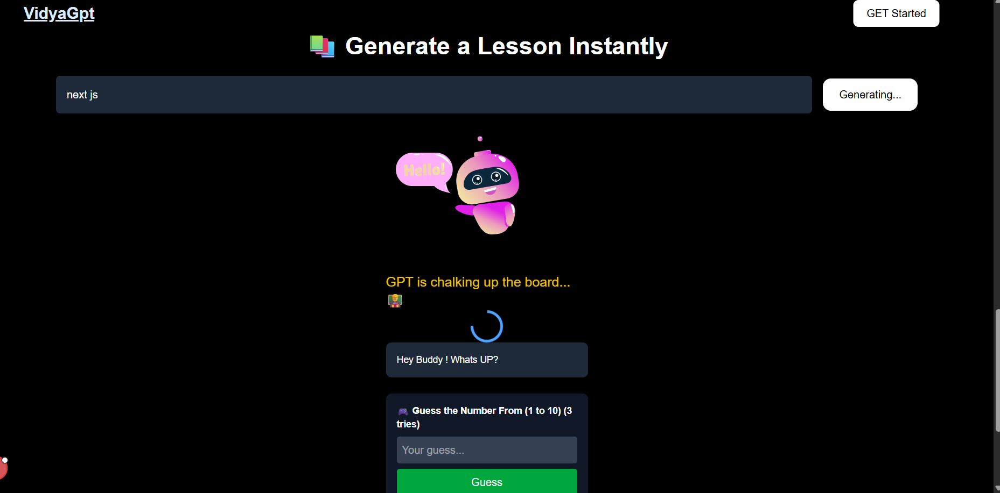
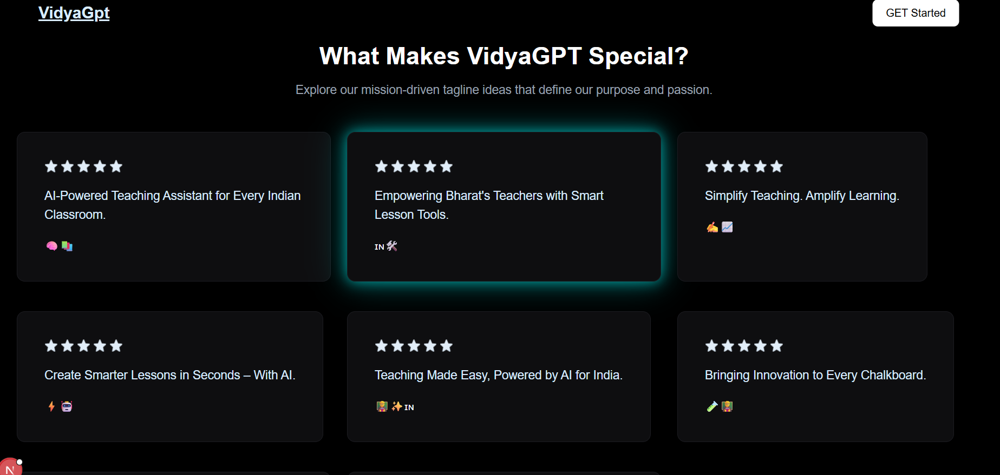

# 🎓 VidyaGPT

<p align="center">
   
</p>

<h1 align="center">🚀 VidyaGPT</h1>
<p align="center">
  <b>AI-powered educational assistant</b><br>
  
  
  
  
</p>

<p align="center">
  <a href="#-features">✨ Features</a> •
  <a href="#-getting-started">🚀 Getting Started</a> •
  <a href="#-folder-structure">📁 Folder Structure</a> •
  <a href="#-license">📝 License</a>
</p>

---

## ✨ Features

<p align="center">
  
  
  
</p>

- 💬 **Ask Questions:** Get instant answers powered by OpenAI.
- 📚 **Summarize Concepts:** Understand complex topics in simpler terms.
- 🌓 **Dark Mode:** Smooth and eye-friendly UI.
- ⚡ **Blazing Fast:** Built with Next.js and optimized for performance.
- 🌐 **SEO-friendly:** Perfect for shareable, searchable pages.

---

## 🚀 Getting Started

```bash
git clone https://github.com/code-place7/VidyaGPT.git
cd VidyaGPT
npm install
# or
yarn install
```

1. **Setup Environment Variables**

   Create a `.env.local` file in the root directory and add your OpenAI key:

   ```env
   OPENAI_API_KEY=your_openai_api_key_here
   ```

2. **Run Development Server**

   ```bash
   npm run dev
   # or
   yarn dev
   ```

---

## 📁 Folder Structure

- `public/` – Static assets (images, icons)
- `src/app/` – Next.js 14 app directory
- `src/components/` – Reusable UI components
- `src/styles/` – Global styles (TailwindCSS)
- `.env.example` – Sample environment config
- `README.md` – You are here
- `package.json` – Project config and scripts
- `next.config.js` – Next.js configuration

---

---

🖼️ Screenshots

<p align="center">    </p>

---

## 🤝 Contributing

Contributions, issues and feature requests are welcome!  
Feel free to check [issues page](../../issues) or submit a pull request.

---

## 📝 License

This project is licensed under the **MIT** License.

---

<p align="center">
  <sub>Made with ❤️ by <b>MONU.DEV</b> | Not affiliated with OpenAI</sub>
</p>
